注意：

**该项目目前还处于开发阶段，仅实现了部分功能，不保证任何效果，并将持续改进**

Gumiho-System是一个Ai辅助的，致力于高质量低成本的，文学性的长文本的翻译系统。

目前已经完成了部分基本功能并进行了少量测试，你可以通过该程式，提前试用其基本功能，利用其汉化来自<https://books.fishhawk.top/>
轻小说机翻机器人网站的轻小说。

使用方式如下：  
解压后，双击打开**GumihoLauncher.exe**

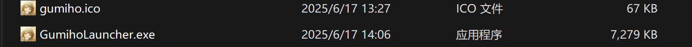

等待所需的依赖和环境下载完成，一切就绪后，你将看到程序的主界面：  
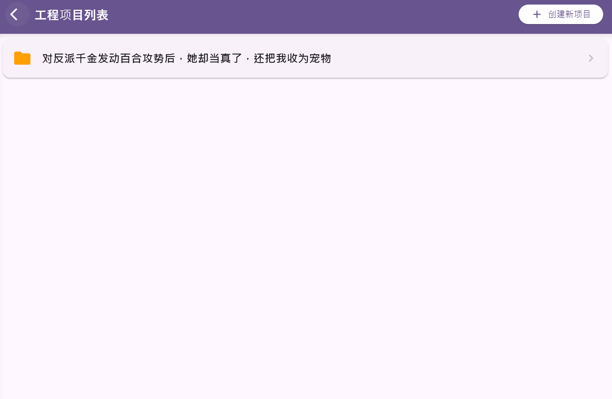  
你所进行翻译工作的每部作品，都会出现在主界面的“工程项目列表中”，其翻译设置相互独立(暂时不推荐修改设置，你可以保持默认，非默认设置没有经过大量测试甚至未完成适配)

## 创建翻译项目

现在，访问<https://books.fishhawk.top/>，找到你想要翻译的小说，点击**下载原文**

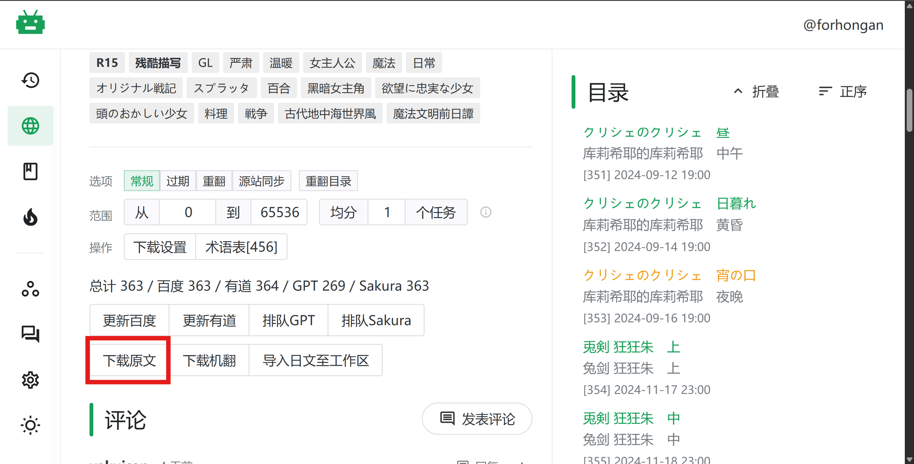

然后，点击 **创建新项目**

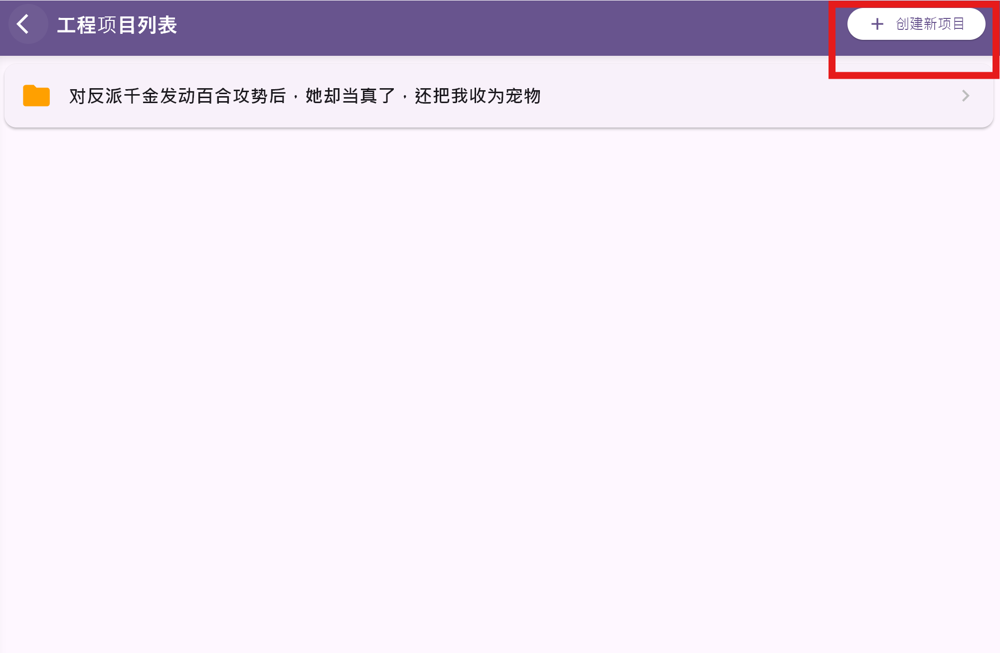

输入信息并**选择你刚刚下载的小说原文**：  
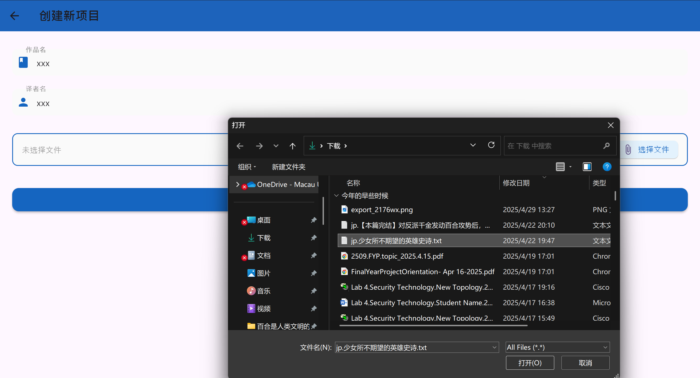

然后，它会出现在主界面的工作区：

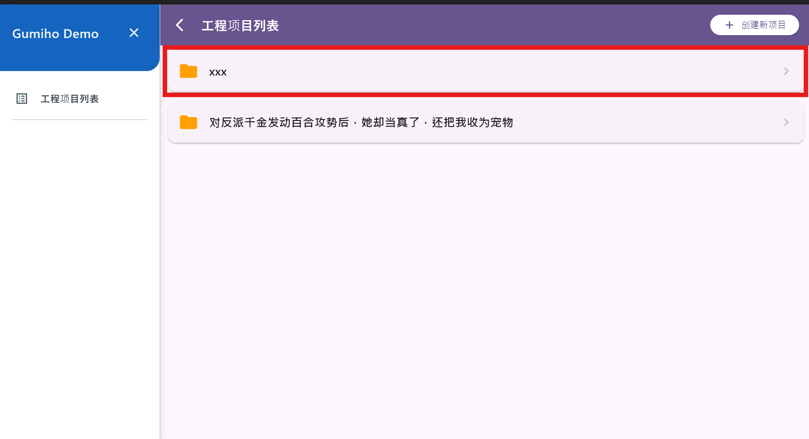

## 进行翻译

点击进入翻译设置

填写api地址(默认Deepseek官网源)，API密钥（结尾有获取教程）

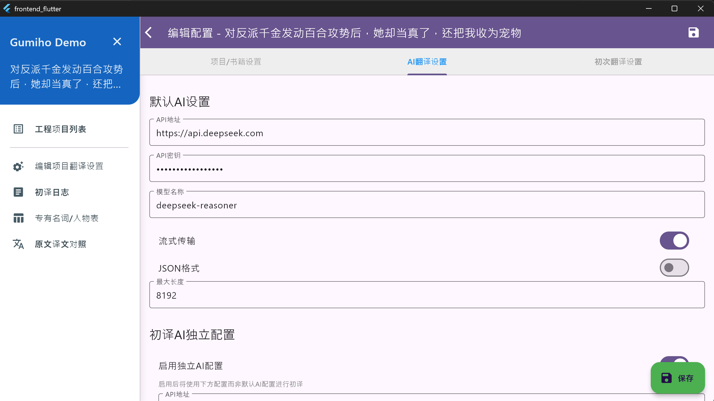

然后，选择“进入翻译界面”

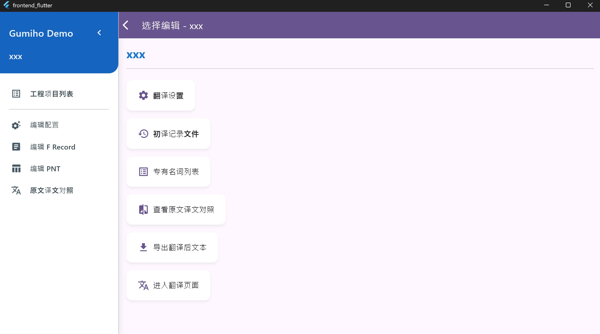

然后，需要稍微介绍一下翻译工程运行的结构，不想了解的人可以跳过这段：

> 该翻译工程会模拟人类阅读的进程，每次使ai“读入”一定量的内容，并生成和维护包括出场人物和内容梗概的知识库。
>
> 本项目提供了你校对翻译，专有名词和人物知识库的功能，并会在非自动模式下，提交并允许你检查这些内容，以方式ai错误理解的知识进入数据库，影响后续整本小说的翻译。在自动模式下，不会要求你检查
>
> 默认**每次翻译 80
> 句**，以实现质量成本速度的平衡（每次翻译的文本不会跨越“章”，且**如果导入的小说存在二级标题，该标题会作为一次的内容被独立翻译**）

**校对模式下，点击开始翻译：**

你会看到Ai响应的过程，默认使用了Deepseek-R1的模型，处理速度较慢但质量较高，你可以在等待返回时做其他事  
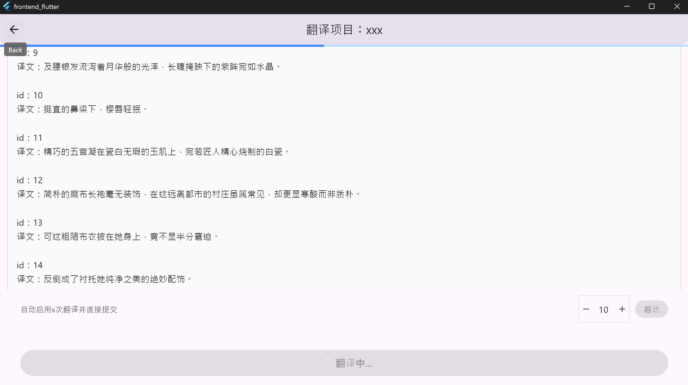

翻译完成后，你可以**查看结果：  **
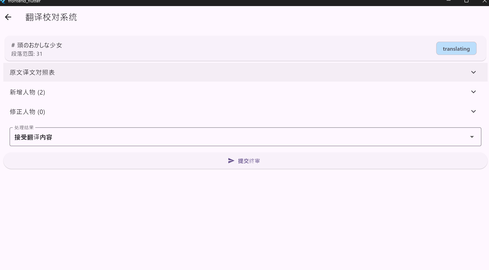

**在此处，你可以手动更改翻译结果，以及定义和的人物及专有名词：  **
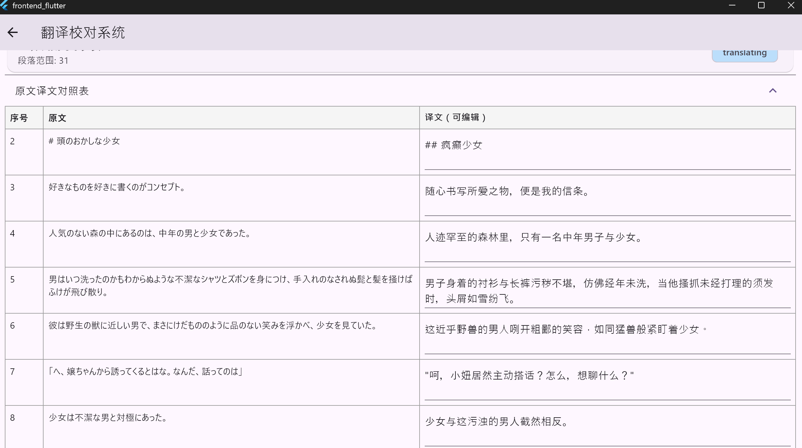**  
  **
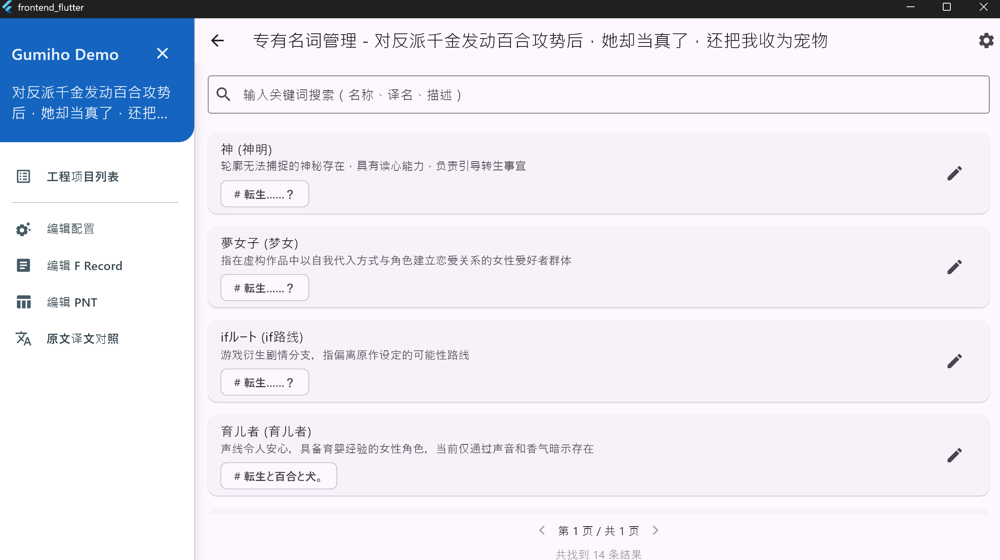**  **
并记得在完成后**点击接受更改并提交**

**  **
你可以在专有名词管理里查看和更改这些内容：  
  
  
当你不想每次都进行检查时，请使用  
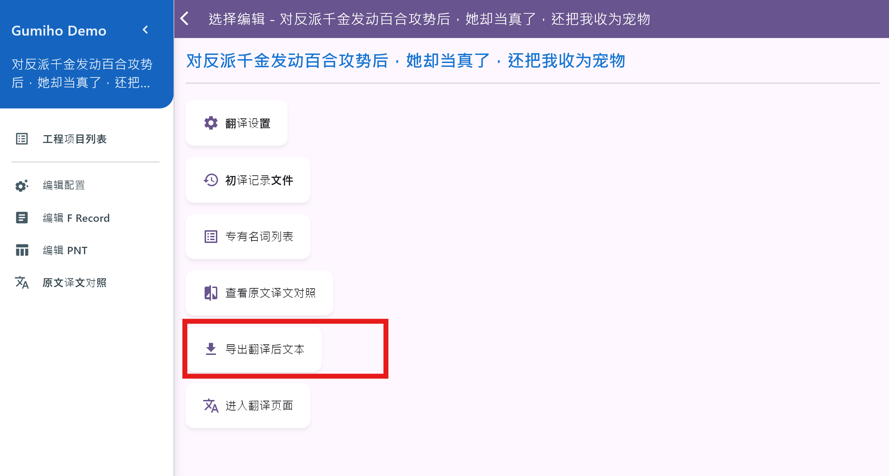  
进行大量自动翻译，挂机翻译器并做其他事

翻译导出

点击导出翻译后文本

选择起始和结束章节

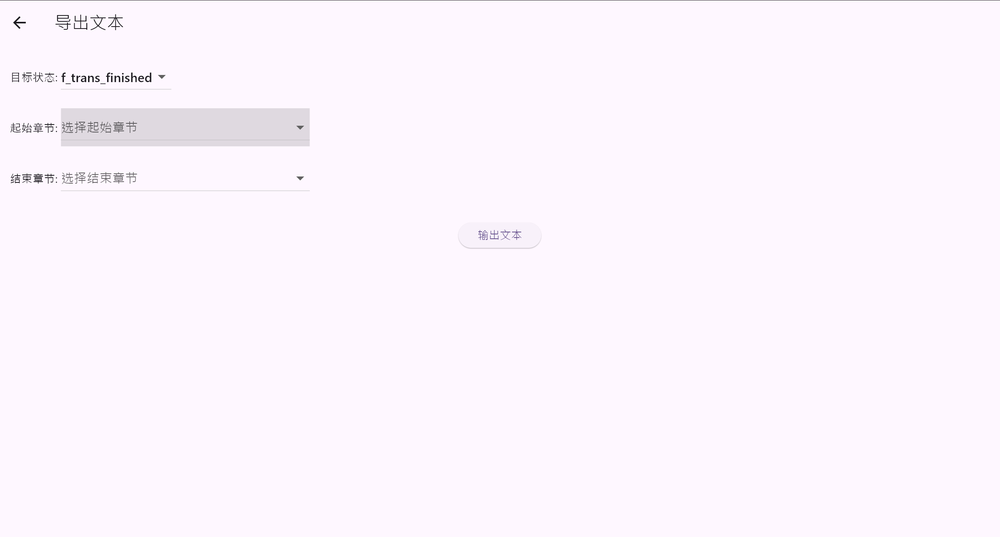**  **
输出文本，**位置默认为backend/你工作区的名字_project** 下  
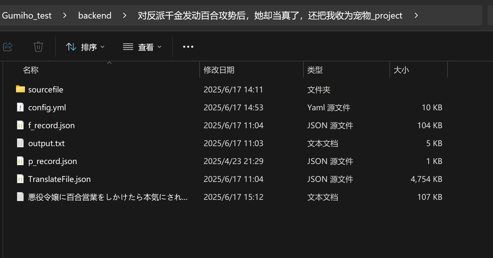

## 获取API和密钥

API和密钥是调取云端大模型的“地址”和“密码”

本项目使用Deepseek-R1模型进行测试，不推荐且不保证使用其他翻译模型的效果

关于获取API，key，以Deepseek官网为例：

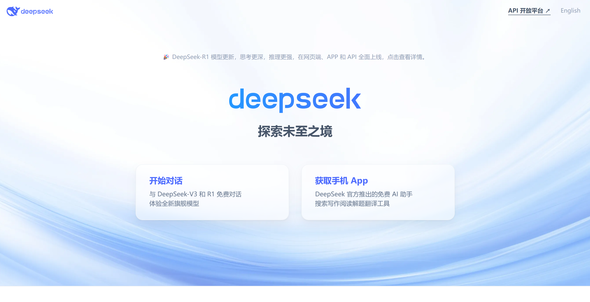

访问官网，点击右上角的 **API开放平台**

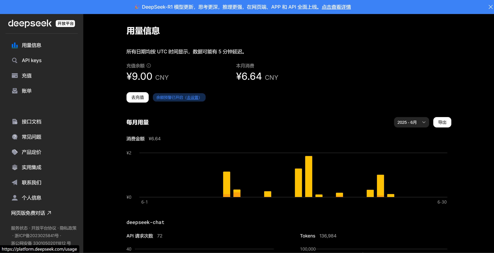

进行一定量充值，注意在线Ai服务不属于本项目内容。

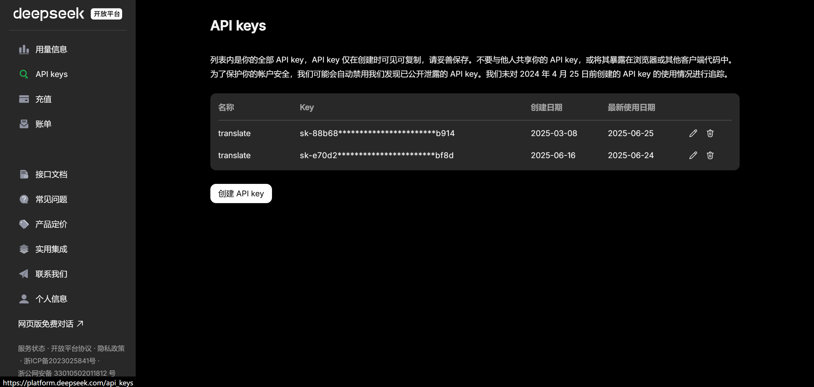

点击**创建API key**，然后将你的key复制到设置的**API密钥一栏**

**注意请自行保管好你的API-KEY**

**同时，如果你了解在线云服务或算力平台，你也可以在其他平台获取API-KEY**

**例如火山方舟，百炼，硅基流动…这些平台可能会提供一定的免费额度**

该项目目前还处于开发阶段，仅实现了部分功能，不保证任何效果，并将持续改进
